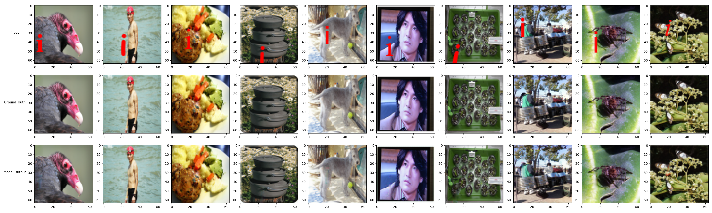

# red i removal
Solves the longstanding problem of red i removal (pain of photographers everywhere circa 1995) by training an ML model to remove red lowercase i characters from images. The architecture is a U-Net CNN with two encoder convolutional blocks, max pool, deconvolution, skip connection, and two decoder convolutional blocks. It's surprisingly light, weighing only 700kb. The model is trained on a synthetic dataset of ~100k images taken from ImageNet augmented by randomly placed red lowercase i characters. Optimization is standard Adam with MSE loss and a cosine annealing scheduler.

Examples from test dataset

## Usage
- `train.py` - trains the model on the synthetic dataset and saves the best model to `outputs/best_model.pth`. Expects a dataset .npz file `train_data_batch_1` in ImageNet format.
- `visualize.py` - loads the best model and visualizes the results on a few samples from dataset `train_data_batch_2`. Saves the visualization to `outputs/visualization.png`.
- `run_inference.py` - runs inference on a single image and saves the output to `outputs/inference_output.png`. Expects an input image given as a command line argument. Note that this model will only work well for the fonts it's trained on (and for a somewhat particular set of font sizes).

 
Example of single inference

